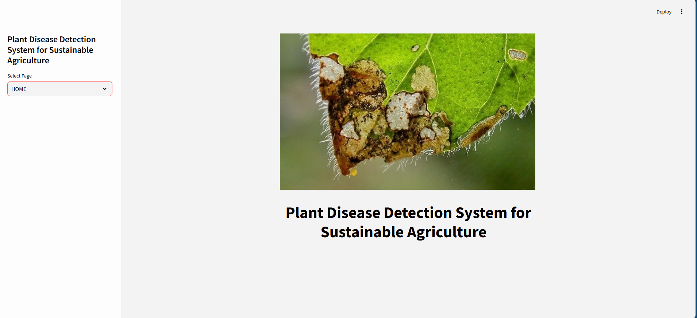
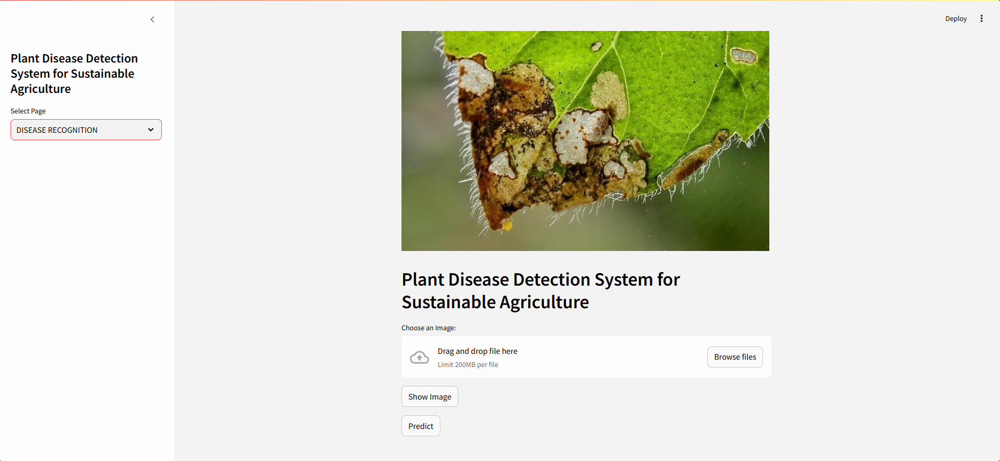
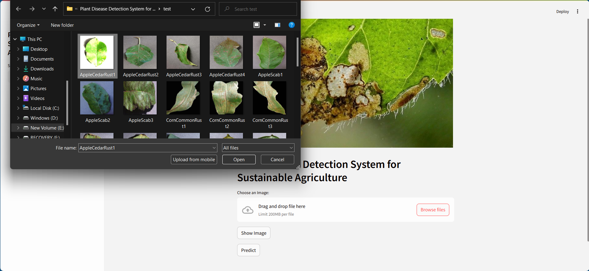
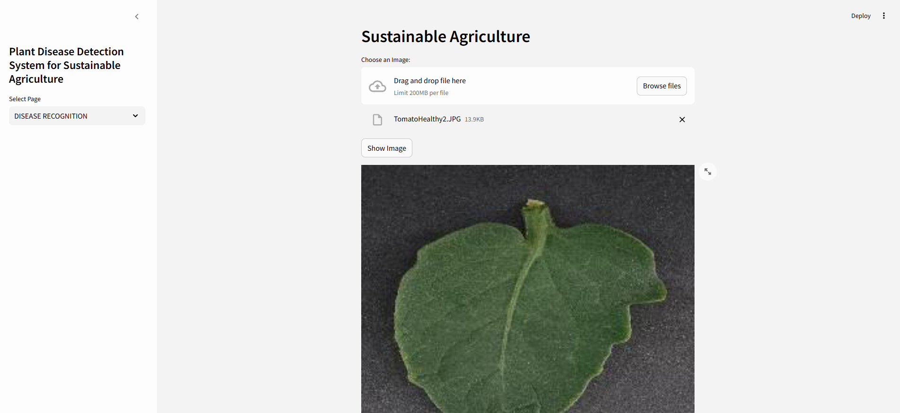
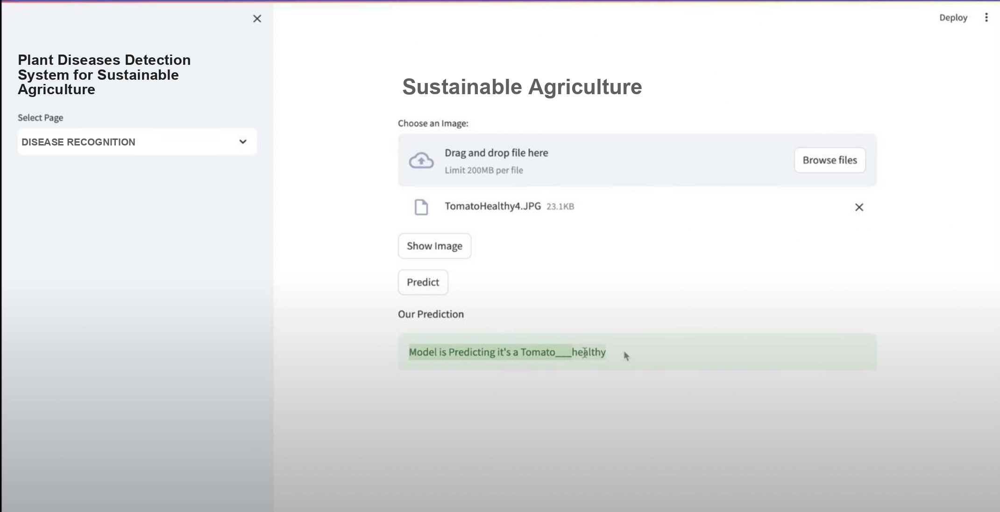

# 🌿 Plant Diseases Detection System for Sustainable Agriculture

This project is a Machine Learning-based web application designed to detect plant diseases from leaf images. The system aims to support sustainable agriculture by helping farmers and agricultural researchers identify diseases early, reduce crop loss, and improve treatment efficiency.

---

## 🚀 Features

- 🏠 **Home Page**: A simple and welcoming UI where users can understand the purpose of the application.
- 🔍 **Prediction Page**: Allows users to upload a plant leaf image for disease prediction.
- 🌱 **Choose Plant Image**: Upload an image of a plant leaf from your device.
- ✅ **Result Display**: The model processes the image and displays the predicted disease (or "healthy" if no disease is detected) along with a confidence score.

---

## 🧠 How It Works

1. The user uploads a plant leaf image.
2. The image is preprocessed and passed through a trained Convolutional Neural Network (CNN) model.
3. The model predicts the class of the disease (e.g., Early Blight, Late Blight, Healthy).
4. The result is displayed with a confidence score.

---

## 🖼️ Output Screens

### 🏠 Home Page


### 📷 Prediction Page


### 🌿 Upload Plant Image


### ✅ Disease Prediction showing


### Output


---

## 🛠️ Technologies Used

- Python
- TensorFlow / Keras
- OpenCV
- Streamlit (for web app)
- Scikit-learn
- NumPy, Pandas, Matplotlib

---

## 📦 Installation

```bash
git clone https://github.com/yourusername/plant-disease-detection-system.git
cd plant-disease-detection-system
pip install -r requirements.txt
streamlit run app.py
